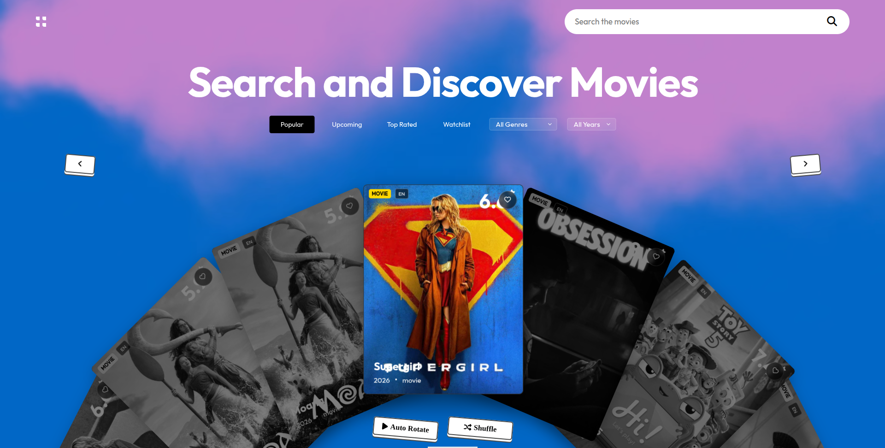
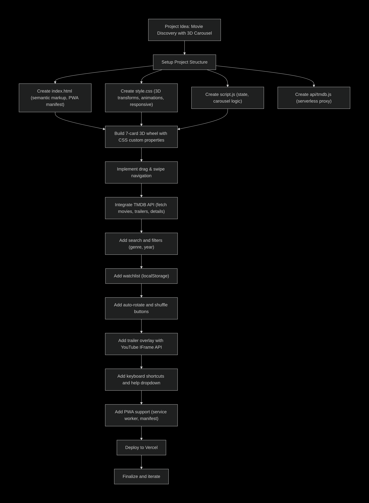
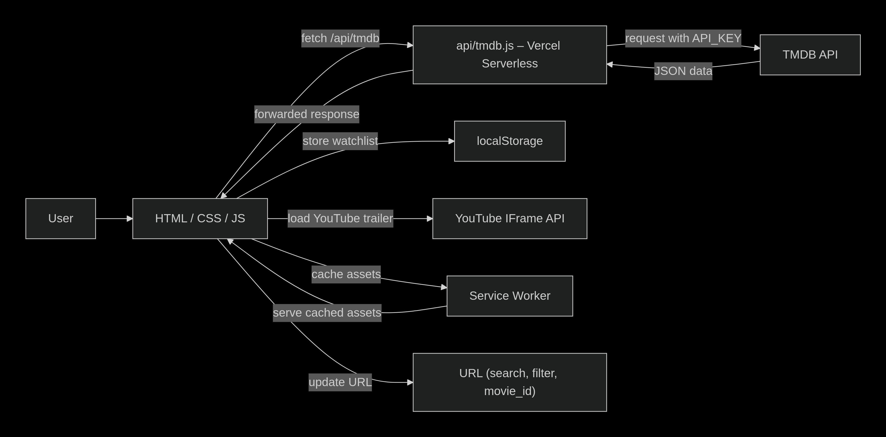

<p align="center">
  <a href="https://moviio.vercel.app/">
    
  </a>
</p>

<h1 align="center">Moviio</h1>

> A cinematic 3D carousel movie explorer powered by TMDB. Discover films, watch trailers, and manage your watchlist with smooth motion!

<p align="center">
  <a href="https://moviio.vercel.app/"> Live Demo</a> •
  <a href="https://github.com/byllzz/moviio/issues/new?labels=bug&template=bug-report---.md"> Report Bug</a> •
  <a href="https://github.com/byllzz/moviio/issues/new?labels=enhancement&template=feature-request---.md"> Request Feature</a>
</p>




# About The Moviio

Welcome to **Moviio** - a modern, interactive movie discovery web app built to deliver an immersive cinematic experience directly in your browser.

Instead of displaying movies in a traditional grid, the application introduces a **custom-built 7-card 3D wheel engine**, allowing users to swipe, drag, or click through movies in an elegant circular layout.

Powered by **TMDB**, the app fetches real-time movie information, official trailers, ratings, genres, and detailed metadata while maintaining buttery-smooth animations and GPU-accelerated performance.

## Why This Project Stands Out

### Custom 3D Wheel Engine
Built from scratch without relying on carousel libraries.

- Pure CSS 3D transforms
- CSS custom properties (`--slot`)
- Vanilla JavaScript animations
- Fully custom wheel implementation

### Cinema Trailer Experience
A dedicated trailer viewing experience with built-in controls.

- Fullscreen trailer overlay
- YouTube player integration
- Play, pause, and fullscreen controls
- Share functionality
- Loading overlay while trailer data is being fetched

### Smart Watchlist
A persistent watchlist designed for convenience.

- LocalStorage persistence
- URL deep linking
- Auto-rotate mode
- Empty-state messaging for new watchlists

### Built-in Help
Quick access to keyboard shortcuts directly from the interface.

- One-click keyboard shortcuts menu

---


 # Architecture & Folder Structure

| File | Description |
|------|-------------|
| index.html | Main application |
| style.css | Global styling |
| script.js | Carousel logic, state management and UI |
| api/tmdb.js | Serverless API proxy (validates TMDB_KEY, forwards TMDB's real status codes) |
| vercel.json | Optional Vercel config (function timeout, etc.) |
| manifest.json | Progressive Web App manifest |
| sw.js | Service Worker (versioned cache, auto-cleans old caches, skips `/api/` routes) |
| assets | Images, media, and diagrams |

---

## Visual Overview

### Development Roadmap (How It Was Built)



### Runtime Architecture (Data Flow)



> **Note:** These diagrams were created with [Mermaid](https://mermaid.live/).The PNGs are included for fast, reliable rendering on any platform.

---

# Moviio Features

## Complete Feature List

| # | Feature | Description |
|---|---------|-------------|
| 01 | 7-Card 3D Wheel | Custom-built carousel with 3D perspective, layered stacking, and smooth transitions. |
| 02 | Drag & Swipe Navigation | Navigate the carousel using mouse drag or touchscreen gestures. |
| 03 | Auto-Rotate Mode | Automatically rotates the wheel every 800ms and pauses on hover. The button sits directly under the left arrow. |
| 04 | TMDB Integration | Fetches Popular, Upcoming, and Top Rated movies in real time. |
| 05 | Instant Search & Filters | Debounced search with Genre and Year filters powered by TMDB Discover API. |
| 06 | Watchlist | Save favorite movies using LocalStorage for persistent access. Shows a dimmed carousel + "Nothing in your watchlist yet" message when empty. |
| 07 | Cinema Trailer Overlay | Watch official YouTube trailers in a fullscreen cinematic overlay. |
| 08 | Overlay Controls | Built-in Play/Pause, Fullscreen, and Share controls. |
| 09 | Dynamic Movie Details | Displays runtime, genres, director, and top cast automatically. |
| 10 | Shuffle Button | Discover hidden gems by loading a random page of movies. Sits directly under the right arrow. |
| 11 | Parallax Tilt Effect | Interactive 3D tilt effect on the active movie card. |
| 12 | URL Deep Linking | Share movies using direct URLs such as `/?movie_id=980431`. |
| 13 | Progressive Web App | Installable on desktop and mobile with offline caching support (versioned service worker cache). |
| 14 | Keyboard Shortcuts | Navigate using Arrow Keys, Enter, Space, and Escape. |
| 15 | Shortcuts Dropdown | A dedicated button next to the search bar toggles a reference card listing every keyboard shortcut. |
| 16 | Trailer Loading Feedback | Clicking a card immediately dims the screen and shows a spinner while trailer/details data is fetched, so the click never feels unresponsive. |
| 17 | Empty-State Handling | Any filter that returns zero results (currently the Watchlist filter) dims the carousel and shows a centered message instead of leaving blank cards on screen. |

---

#  Usage

Once the application is running, you'll be welcomed by an immersive **3D movie carousel** designed to make discovering films feel like browsing a virtual cinema. Navigate effortlessly, watch trailers, and build your personal watchlist-all from a single interface.

## Explore the Features

###  Browse Movies
Navigate through the custom 3D carousel using your preferred input method:

- Click the **Previous** and **Next** buttons
- Drag the carousel with your mouse
- Swipe on touch devices
- Use the **←** and **→** arrow keys

---

###  Search & Filter
Quickly find the perfect movie with powerful filtering options:

- Search by movie title
- Filter by **Genre**
- Filter by **Release Year**

> **Tip:** Searches are automatically debounced for a smoother and more efficient experience.

---

###  Build Your Watchlist
Keep track of movies you want to watch by clicking the **❤️ heart icon** on any movie card.

Your watchlist includes:

- Persistent storage using **LocalStorage**
- One-click add or remove
- Dedicated **Watchlist** filter
- A dimmed carousel with a friendly "Nothing in your watchlist yet" message if you haven't saved anything yet

---

###  Watch Official Trailers
Select the **center (active) movie card** to launch the cinematic trailer overlay.

The application automatically loads the official YouTube trailer whenever one is available. While the trailer and movie details are being fetched, the screen dims and a spinner shows so you always know something is happening.

---

###  Trailer Controls
The fullscreen player includes convenient playback controls:

- ▶ Play / Pause
-  Fullscreen Mode
-  Share Movie Link

---

###  Auto Rotate
Enable **Auto Rotate** (button under the left arrow) to let the carousel automatically cycle through movies.

The animation pauses while your cursor is over the carousel and resumes once you move away.

---

###  Shuffle
Click **Shuffle** (button under the right arrow) to jump to a random page of popular movies - a quick way to discover something you wouldn't normally scroll to.

---

###  Keyboard Shortcuts
Click the keyboard icon next to the search bar to open a quick-reference dropdown of every shortcut:

| Key | Action |
|-----|--------|
| `←` `→` | Navigate cards |
| `Enter` / `Space` | Open the active card's trailer |
| `Esc` | Close the trailer overlay |

---

###  Share Movies
Share a specific movie using a direct URL.

```text
/?movie_id=980431
```

Opening the link automatically loads that movie and displays its trailer.

---

#  Live Demo

Skip the installation and experience the application instantly.

👉 **https://moviio.vercel.app/**

Explore the interactive 3D carousel, search thousands of movies, watch official trailers, and manage your watchlist directly in your browser.

---

# Built With

This project is built entirely using modern web technologies together with a serverless API proxy.

## Technologies

| Technology | Purpose |
|------------|---------|
| HTML5 | Semantic markup and PWA support |
| CSS3 | Layouts, animations, 3D transforms, responsive UI |
| Vanilla JavaScript (ES6+) | State management, Fetch API, DOM manipulation |
| TMDB API | Movies, trailers, posters and metadata |
| YouTube IFrame API | Trailer playback |
| Vercel | Deployment and serverless functions |

### Tech Stack Badges


---

# Getting Started

Follow these steps to run the project locally.

## Prerequisites

Before starting, make sure you have:

- A modern browser (Chrome, Firefox, Edge, or Safari)
- Visual Studio Code (recommended)
- A TMDB API Key

Request an API key from:

https://www.themoviedb.org/

---


# Installation

## 1. Clone the repository

```bash
git clone https://github.com/byllzz/moviio.git
```

---

## 2. Enter the project directory

```bash
cd moviio
```

---

## 3. Configure your TMDB API Key

This project uses a **serverless Vercel API proxy** located at `api/tmdb.js`.

Create a `.env` file in the project root.

```text
TMDB_KEY=your_tmdb_api_key
```

Replace:

```
your_tmdb_api_key
```

with your actual **TMDB API v3 Key**.

> `api/tmdb.js` will return a clean `500` error if `TMDB_KEY` is missing, and forwards TMDB's real HTTP status codes instead of always returning 200 - check your Network tab if movies aren't loading.

---

## Deploying on Vercel

If deploying online:

1. Open your Vercel Dashboard.
2. Navigate to your project.
3. Open **Settings → Environment Variables**.
4. Create a variable named:

```text
TMDB_KEY
```

5. Paste your TMDB API Key.
6. **Redeploy the project** - adding or changing an environment variable does *not* retroactively apply to an already-running deployment. If you see a "Needs Attention" badge next to the variable in the dashboard, that's exactly why: redeploy to pick it up.

---

# Running the Project

There are two ways to launch the app.

## Option A - Open Directly

Simply open:

```
index.html
```

However, because the application uses a serverless API (`/api/tmdb`), opening it via:

```
file://
```

will prevent API requests from working.

---

## Option B - Live Server (Recommended for markup/style changes only)

1. Open the project in Visual Studio Code.
2. Install the **Live Server** extension.
3. Right-click `index.html`.
4. Select **Open with Live Server**.

> ⚠️ Live Server is a static file server only - it does **not** run `api/tmdb.js`. Any request to `/api/tmdb` will 404, and movies won't load. Live Server is fine for CSS/HTML tweaks, but for anything touching the API use Option C below.

---

## Option C - Vercel CLI (Recommended for full functionality)

```bash
npm install -g vercel
vercel dev
```

This runs the serverless function locally exactly as it runs in production, so `/api/tmdb` actually works.

---

# Environment Variables

Create a `.env` file in the root directory.

```env
TMDB_KEY=your_tmdb_api_key
```

Never commit your `.env` file to GitHub.

Ensure `.env` is included in your `.gitignore`.

---

# Project Requirements

- HTML5-compatible browser
- JavaScript enabled
- Internet connection (for TMDB and YouTube APIs)
- Valid TMDB API Key
- For local API testing: Vercel CLI (`vercel dev`) - plain Live Server will not run `api/tmdb.js`

---

<!-- CONTRIBUTING -->

# Contributing

Contributions are always welcome! Whether you've found a bug, have an idea for a new project, or want to improve the existing code, your help is appreciated.

### Ways to Contribute

-  Report bugs by opening an issue.
-  Suggest new JavaScript mini-project ideas.
-  Improve the code, documentation, or UI.
-  Help enhance the README or project organization.

---

### Getting Started

1. **Fork** this repository.
2. **Clone** your fork locally.

```bash
git clone https://github.com/byllzz/moviio.git
```

3. Create a new feature branch.

```bash
git checkout -b feat/amazing-feature
```

4. Make your changes and commit them.

```bash
git commit -m "Add your amazing feature"
```

5. Push your branch.

```bash
git push origin feat/amazing-feature
```

6. Open a **Pull Request** describing your changes.

---

###  Show Your Support

If you found this repository helpful:

-  Star the repository
-  Fork it
-  Share it with other developers

Every contribution, no matter how small, helps make this project better.

---

###  Contributors

A big thank you to everyone who has contributed to this project!

<a href="https://github.com/byllzz/moviio/graphs/contributors">
  
</a>

<p align="right">(<a href="#readme-top">Back to Top ↑</a>)</p>

---

<!-- AUTHOR -->

#  Author

<p align="left">
  
</p>

<h3 align="left">Bilal Malik (byllzz)</h3>

<p align="left">
  Front-End Developer • JavaScript Enthusiast • Open Source Contributor
</p>

<p align="left">
  <a href="https://github.com/byllzz">
    
  </a> <br>
  <a href="https://x.com/bilalmlkdev">
    
  </a> <br>
  <a href="https://bilalmlkdev.vercel.app">
    
  </a>
</p>

<p align="left">
  If you enjoyed this project, consider giving it a ⭐ on GitHub!
</p>

<p align="right">(<a href="#readme-top">Back to Top ↑</a>)</p>

---

### `LICENSE` (MIT)

```
MIT License

Copyright (c) 2026 Bilal Malik

Permission is hereby granted, free of charge, to any person obtaining a copy
of this software and associated documentation files (the "Software"), to deal
in the Software without restriction, including without limitation the rights
to use, copy, modify, merge, publish, distribute, sublicense, and/or sell
copies of the Software, and to permit persons to whom the Software is
furnished to do so, subject to the following conditions:

The above copyright notice and this permission notice shall be included in all
copies or substantial portions of the Software.

THE SOFTWARE IS PROVIDED "AS IS", WITHOUT WARRANTY OF ANY KIND, EXPRESS OR
IMPLIED, INCLUDING BUT NOT LIMITED TO THE WARRANTIES OF MERCHANTABILITY,
FITNESS FOR A PARTICULAR PURPOSE AND NONINFRINGEMENT. IN NO EVENT SHALL THE
AUTHORS OR COPYRIGHT HOLDERS BE LIABLE FOR ANY CLAIM, DAMAGES OR OTHER
LIABILITY, WHETHER IN AN ACTION OF CONTRACT, TORT OR OTHERWISE, ARISING FROM,
OUT OF OR IN CONNECTION WITH THE SOFTWARE OR THE USE OR OTHER DEALINGS IN THE
SOFTWARE.

```


## Acknowledgements

This project uses the following services and technologies:

- **TMDB API** for movie data
- **YouTube IFrame API** for trailer playback
- **Vercel** for deployment and serverless functions
- **HTML5**, **CSS3**, and **Vanilla JavaScript (ES6+)**

---

© 2026 Moviio. Licensed under the **MIT License**.
